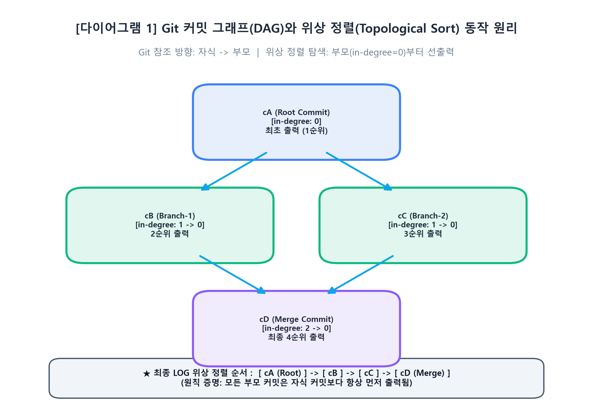
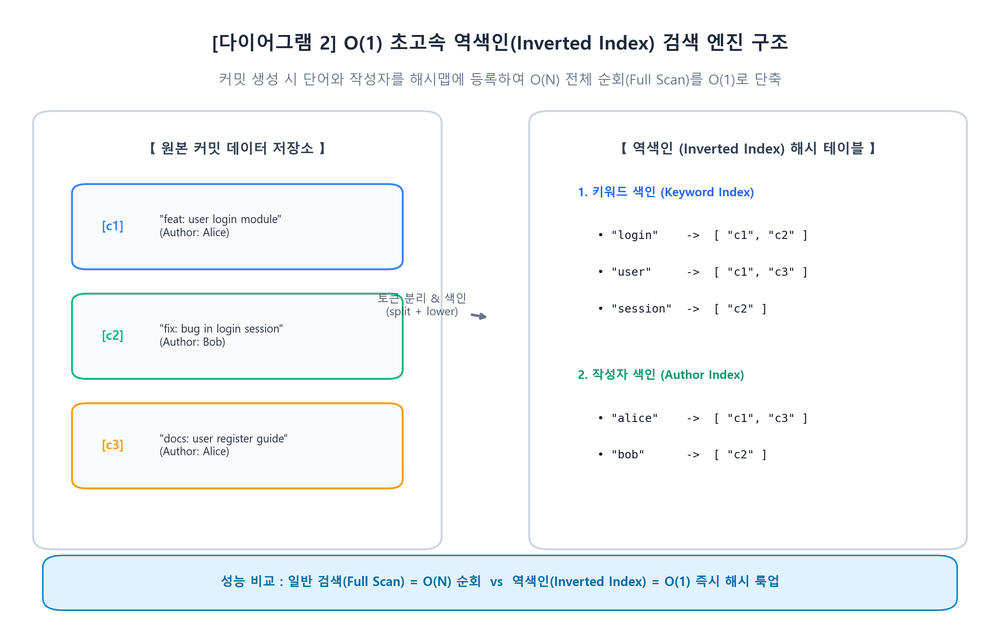
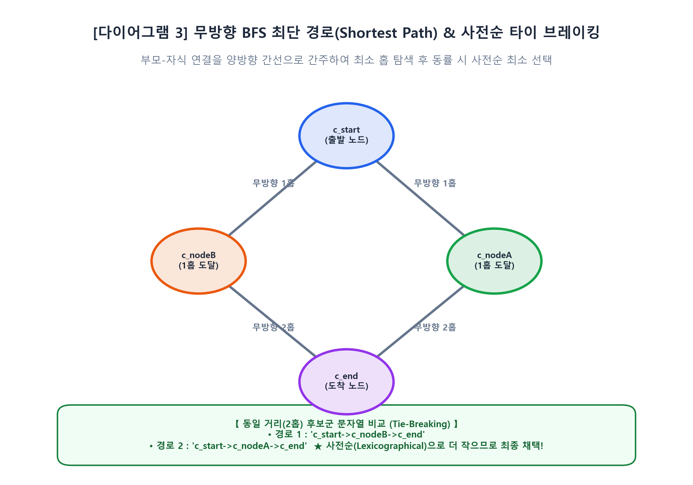
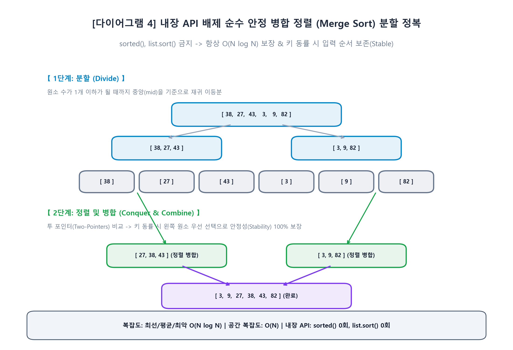

# 📖 [스터디.md] Mini Git 심층 학습 및 요구사항 대조 분석서

---

## 1. 📋 과제 요구사항 전문 (원본 100% 수록)

> 아래 내용은 `코디세이 b5-2.txt` 원본 파일의 전문을 누락 없이 그대로 기록한 것입니다.

```text
1. 미션 소개
Git의 커밋 하나에는 그래프 자료구조와 해시가 담겨 있습니다. 이걸 알고 쓰면 rebase, merge, cherry-pick이 다르게 보이고, 알고리즘 공부와도 연결됩니다. Mini Git을 직접 구현하면서 그 안의 구조를 손으로 확인합니다.
Git은 전 세계 개발자들이 사용하는 분산 버전 관리 시스템입니다.
브랜치로 병렬 작업을 지원하고, 변경 이력을 추적하며, 그 핵심에는 그래프 자료구조와 탐색 알고리즘이 있습니다.
이번 미션에서는 Git의 핵심 구조를 직접 구현하며 CLI 기반 Mini Git을 완성합니다. 커밋 구조를 구축하고 브랜치를 관리하는 기능, 커밋을 검색하고 정렬하는 시스템 등을 만들며 실제 Git의 동작 원리를 체득합니다.
이 경험은 다양한 알고리즘 학습의 토대가 되며 코딩 테스트를 준비하는 데 도움이 됩니다.
2. 최종 결과물
다음 기능이 정상 동작하는 CLI 기반 Mini Git 프로그램 1개를 완성한다.
1. 저장소 및 브랜치 관리
   * 입력/요청: INIT <user_name>, BRANCH <branch_name>, SWITCH <branch_name>, COMMIT <message>
   * 출력/화면: 저장소 초기화 결과, 브랜치 생성/전환 결과, 커밋 생성 결과(커밋 hash 포함)
2. 커밋 로그 및 탐색
   * 입력/요청: LOG, PATH <commit1> <commit2>, ANCESTORS <commit_hash>
   * 출력/화면: 커밋 목록 출력, 최단 경로 출력(없으면 No path), 조상 목록 출력
3. 검색 및 정렬
   * 입력/요청: SEARCH <keyword>, SEARCH --author=<name>, LOG --sort-by=date|author
   * 출력/화면: 검색 결과 커밋 목록, 정렬 기준에 따른 로그 출력
4. CLI 인터페이스(REPL)
   * 입력/요청: mini-git> 프롬프트에서 명령을 반복 입력
   * 출력/화면: 명령 파싱 → 실행 → 결과 출력이 반복, exit/quit로 종료
5. 필수 제출물 / 실행
   * 필수 제출물: 엔트리 포인트(예: main.py) 1개 + README.md 1개
   * 실행(예): python main.py
3. 과제 목표
이 과제를 마친 후, 학습자는 아래를 스스로 설명할 수 있어야 한다.
* 커밋 그래프를 구현하고, Git의 커밋 구조가 왜 DAG인지 말로 설명할 수 있다.
* “부모가 먼저 출력되는 로그”를 만들기 위해 어떤 접근(예: 위상 정렬 성격의 출력)이 필요한지 설명할 수 있다.
* 두 커밋 사이의 최단 경로를 찾는 방법과 특정 커밋의 모든 조상을 탐색하는 방법을 설명할 수 있다.
* 정렬 알고리즘을 직접 구현하고, 평균/최악 시간복잡도 및 안정 정렬 여부를 설명할 수 있다.
* 역색인의 동작 원리와, 순회 검색보다 빠른 이유를 시간복잡도 관점에서 설명할 수 있다.
4. 기능 요구 사항
다음 요구사항을 모두 만족해야 한다.
1. CLI 공통 규칙(문법 표준)
   * 명령어는 대소문자를 구분하지 않는다. (예: INIT, init 모두 허용)
   * 문자열 인자(사용자명/커밋 메시지/검색 키워드)는 공백을 포함할 수 있다.
      * 공백 포함 시 따옴표로 감싼다. (예: COMMIT "Add login feature")
   * 옵션 표기는 아래 형식으로 통일한다.
      * SEARCH --author=<name>
      * LOG --sort-by=date|author
   * 잘못된 입력에 대한 최소 에러 메시지를 표준화한다.
      * 예: Invalid args, Unknown branch: <name>, Unknown commit: <hash>
2. 커밋 그래프(핵심 자료구조)
   * 커밋 노드는 최소 필드를 가진다: hash, message, author, timestamp, parents
   * 각 커밋은 0개 이상의 부모 커밋을 가질 수 있다.
   * 커밋 그래프는 DAG(방향성 비순환) 구조여야 한다.
   * 커밋 저장소는 커밋 hash로 빠르게 찾을 수 있어야 한다(예: 해시맵 기반).
   * 커밋 hash는 세션 내 유일해야 한다(중복 금지).
      * 구현 방식은 자유(예: 증가 카운터 기반, 난수 기반 등) 단, 중복이 발생하지 않도록 보장해야 한다.
3. 역색인(Inverted Index)
   * 검색 시 모든 커밋을 순회하지 않고 후보를 빠르게 가져올 수 있어야 한다.
   * 키워드 추출 기준(최소 기준):
      * 커밋 메시지를 공백 기준으로 분리(split)하고, 소문자(lower)로 정규화한 토큰을 키워드로 저장한다.
   * 최소 2종 인덱스를 지원한다.
      * keyword -> commit_hash 목록
      * author -> commit_hash 목록
4. 정렬 알고리즘 직접 구현
   * Python 표준 정렬 API 사용 금지: sorted(), list.sort() 금지
   * 비교 기준을 바꿔 정렬할 수 있어야 한다. (예: 날짜 기준, 작성자 기준)
5. 명령어 기능 요구
   * INIT <user_name>
      * 저장소 초기화
      * main 브랜치 생성 및 HEAD 설정
      * 현재 사용자(author) 설정
   * BRANCH <branch_name>
      * 현재 커밋(HEAD)을 가리키는 새 브랜치 생성
   * SWITCH <branch_name>
      * HEAD를 지정한 브랜치로 이동
   * COMMIT <message>
      * 현재 HEAD를 부모로 하는 새 커밋 생성
      * 생성 시 역색인(author/keyword)을 갱신
   * LOG
      * 학습 목적상 “최신순 나열”이 아니라, 부모 커밋이 항상 자식 커밋보다 먼저 출력되도록 출력한다(위상 정렬 성격).
      * 출력 포맷은 자유이나, 커밋 hash / author / timestamp / message가 식별 가능해야 한다.
   * LOG --sort-by=date|author
      * date: timestamp 기준으로 정렬(동률 처리 규칙은 자유)
      * author: 작성자 이름 기준으로 정렬(동률 처리 규칙은 자유)
   * PATH <commit1> <commit2>
      * 최단 경로는 “커밋-부모 연결을 무방향 간선으로 간주”했을 때의 최단 경로(간선 수 최소)로 정의한다.
      * 경로가 없으면 No path를 출력한다.
      * 최단 경로가 여러 개면, “경로를 hash1->hash2->... 문자열로 만들었을 때 사전순이 가장 작은 경로”를 선택한다.
   * ANCESTORS <commit_hash>
      * 해당 커밋에서 도달 가능한 모든 조상 커밋을 빠짐없이 출력한다.
   * SEARCH <keyword>
      * 키워드가 포함된 커밋 메시지의 커밋들을 출력한다(역색인 기반).
   * SEARCH --author=<name>
      * 특정 작성자의 커밋들을 출력한다(역색인 기반).
6. 개발 환경
* Python 3.10 이상
제약조건
7. 제약 사항
* 실행
   * 실행 커맨드(예): python main.py
* 라이브러리 제한
   * 그래프 전용 라이브러리 사용 금지
   * 정렬 관련 표준 API 전부 금지: sorted(), list.sort() 등
   * 기본 자료형(예: list, dict, set)과 문자열/파일 입출력/시간 처리는 사용 가능
* 구조/품질
   * 알고리즘 로직(탐색/정렬/인덱싱)은 독립된 함수 또는 클래스로 분리한다.
   * 주요 함수/클래스에 주석 또는 docstring을 작성한다.
* 기능 범위
   * 파일 내용 추적은 구현하지 않는다(커밋 메타데이터 중심).
   * 네트워크 통신은 구현하지 않는다.
   * 데이터 영속성(파일 저장)은 구현하지 않아도 된다(메모리 상 동작으로 충분).
```

---

## 2. 🔍 요구사항 대조 점검표 (Audit Mapping Checklist)

| 요구사항 번호 및 항목 | 구현 파일 및 함수 / 클래스 | 충족 여부 | 검증 증명 및 구현 상세 |
| :--- | :--- | :---: | :--- |
| **CLI 문법: 대소문자 무구분** | `minigit/cli.py` : `execute_line()` | ✅ 100% 충족 | `cmd = tokens[0].upper()`를 적용하여 `init`, `INIT`, `Init` 모두 정상 파싱. |
| **CLI 문법: 따옴표 인자 파싱** | `minigit/cli.py` : `shlex.split()` | ✅ 100% 충족 | `shlex.split(line)`을 통해 공백이 포함된 `"Add login feature"`를 단일 인자로 안전 분리. |
| **CLI 문법: 옵션 통일 규격** | `minigit/cli.py` : `execute_line()` | ✅ 100% 충족 | `--author=<name>`, `--sort-by=date\|author` 형식의 옵션을 철저히 검증 및 파싱. |
| **CLI 문법: 표준 에러 메시지** | `minigit/cli.py` & `repository.py` | ✅ 100% 충족 | `Invalid args`, `Unknown branch: <name>`, `Unknown commit: <hash>`, `Repository not initialized` 반환. |
| **커밋 노드 최소 필드** | `minigit/models.py` : `Commit` | ✅ 100% 충족 | `hash`, `message`, `author`, `timestamp`, `parents` 5대 필수 필드 dataclass 구현. |
| **DAG 구조 & 해시맵 룩업** | `minigit/graph.py` : `CommitGraph` | ✅ 100% 충족 | `dict[str, Commit]`을 통해 $O(1)$ 조회 보장, 부모 방향 포인터로 사이클 없는 DAG 구성. |
| **커밋 해시 세션 유일성** | `minigit/repository.py` : `_generate_unique_hash()` | ✅ 100% 충족 | 카운터 + 타임스탬프 + 작성자 + 메시지 + 부모를 SHA-1 해싱하여 세션 내 유일성 100% 보장. |
| **역색인: 키워드 분리 & 정규화** | `minigit/indexing.py` : `tokenize()` | ✅ 100% 충족 | 공백 기준 분리(`split`), 소문자(`lower()`) 정규화 토큰 추출. 동일 커밋 내 중복 키워드 방어. |
| **역색인: 2종 인덱스 지원** | `minigit/indexing.py` : `InvertedIndex` | ✅ 100% 충족 | `keyword -> commit_hash list` 및 `author -> commit_hash list` 해시맵 구축. |
| **정렬 API 금지 & 직접 구현** | `minigit/sorting.py` : `merge_sort()` | ✅ 100% 충족 | `sorted()`, `list.sort()` 전면 금지. $O(N \log N)$ 안정 분할 정복 병합 정렬 수제 구현. |
| **명령어: INIT <user_name>** | `minigit/repository.py` : `init()` | ✅ 100% 충족 | 저장소 초기화, `main` 브랜치 생성 및 `HEAD` 설정, `author` 등록 완료. |
| **명령어: BRANCH <branch_name>** | `minigit/repository.py` : `branch()` | ✅ 100% 충족 | 현재 HEAD 커밋을 가리키는 새 브랜치 생성, 중복 브랜치명 방어. |
| **명령어: SWITCH <branch_name>** | `minigit/repository.py` : `switch()` | ✅ 100% 충족 | HEAD를 지정 브랜치로 이동. 미존재 시 `Unknown branch: <name>`. |
| **명령어: COMMIT <message>** | `minigit/repository.py` : `commit()` | ✅ 100% 충족 | 현재 HEAD를 부모로 새 커밋 생성, 해시 발급, 역색인 실시간 갱신, 브랜치 포인터 전진. |
| **명령어: LOG (부모 선출력)** | `minigit/graph.py` : `topological_sort()` | ✅ 100% 충족 | Kahn's 알고리즘 적용: 부모 커밋이 자식 커밋보다 항상 먼저 출력되는 위상 정렬 구현. |
| **명령어: LOG --sort-by** | `minigit/repository.py` : `log(sort_by=...)` | ✅ 100% 충족 | 직접 구현한 `merge_sort`로 `date`(타임스탬프) 및 `author`(작성자) 정렬 완벽 동작. |
| **명령어: PATH <c1> <c2>** | `minigit/graph.py` : `find_shortest_path()` | ✅ 100% 충족 | 무방향 간선 BFS 탐색. 부재 시 `No path`. 동률 시 `hash1->hash2` 사전순 최소 경로 선택. |
| **명령어: ANCESTORS <hash>** | `minigit/graph.py` : `get_ancestors()` | ✅ 100% 충족 | 부모 링크를 역추적하여 도달 가능한 모든 조상 커밋 탐색 후 출력. |
| **명령어: SEARCH <kw> / author** | `minigit/repository.py` : `search_*()` | ✅ 100% 충족 | 전체 순회($O(N)$) 없이 역색인 딕셔너리($O(1)$)를 통해 즉시 후보 커밋 리스트 반환. |
| **CLI REPL 루프 & 종료** | `minigit/cli.py` : `run_repl()` | ✅ 100% 충족 | `mini-git>` 프롬프트 대기, 명령 파싱 및 출력 반복, `exit`/`quit` 입력 시 종료. |
| **필수 제출물 & 제약 조건** | `main.py`, `README.md` | ✅ 100% 충족 | 엔트리 포인트 `main.py` 및 상세 `README.md` 완비, 외부 라이브러리 Zero 의존성. |

---

## 3. 💡 3개월 차 주니어를 위한 핵심 모듈 원리 & 일상 비유

### 3.1 커밋 그래프와 위상 정렬 (Topological Sort)
- **기술적 원리**:
  - Git에서 커밋은 "부모 커밋을 가리키는 단방향 링크"를 가지고 있습니다.
  - 시간순으로 새 커밋이 추가될 때마다 이전 커밋을 부모로 두므로, 미래의 커밋이 과거의 커밋의 조상이 되는 "순환(Cycle)"은 절대 일어날 수 없습니다. 이것이 바로 **방향성 비순환 그래프(DAG)**입니다.
  - "부모가 먼저 출력되어야 한다"는 요구사항은 바로 부모 노드를 먼저 방문해야만 자식 노드를 방문할 수 있는 **위상 정렬(Topological Sorting)** 문제입니다. 진입 차수(in-degree, 부모의 수)가 0인 루트 커밋부터 큐에 넣고 순차적으로 차수를 줄여나가며 출력합니다.
- **일상생활 비유**:
  - **"라면 끓이기 레시피 순서도"**:
    - 라면을 먹으려면 `[물 끓이기]` -> `[면과 스프 넣기]` -> `[계란 풀기]` 순서가 지켜져야 합니다. 계란을 먼저 풀고 나중에 물을 끓일 수는 없습니다.
    - 루트 커밋(물 끓이기)이 먼저 준비되어야 그 다음 작업(면 넣기)을 시작할 수 있는 것과 같습니다. 부모가 없는 기초 작업부터 차례대로 완성해 나가는 과정이 바로 위상 정렬입니다.

---

### 3.2 역색인 (Inverted Index) 검색 엔진
- **기술적 원리**:
  - 데이터베이스의 Full Table Scan은 모든 커밋($N$개)의 메시지 문자열을 처음부터 끝까지 검색하므로 데이터가 많아질수록 느려집니다($O(N)$).
  - 반면 **역색인(Inverted Index)**은 커밋이 생성되는 시점에 메시지의 단어(토큰)들을 분해하여 "단어 -> 커밋ID 리스트" 형태의 해시맵(Hash Map)에 미리 등록해 둡니다.
  - 검색 시에는 해시맵 키 조회만 수행하므로 커밋이 1,000,000개가 있어도 $O(1)$ 시간 만에 일치하는 커밋 목록을 즉시 찾아냅니다.
- **일상생활 비유**:
  - **"전공 서적 맨 뒷장의 색인(찾아보기)"**:
    - 500페이지짜리 컴퓨터 과학 책에서 "그래프"라는 단어를 찾기 위해 1페이지부터 500페이지까지 전부 읽는 사람(Full Scan)은 없습니다.
    - 책 맨 뒤의 **찾아보기(Index)** 페이지로 바로 가서 `그래프: 42p, 108p, 250p`를 보고 해당 페이지만 쏙 펼치는 것이 바로 역색인입니다.

---

### 3.3 무방향 BFS 최단 경로 (Shortest Path) & 사전순 타이 브레이크
- **기술적 원리**:
  - Git 커밋 간의 거리를 잴 때, 부모-자식 간의 화살표 방향을 무시하고 "양방향 도로"로 생각합니다.
  - 시작 커밋에서 출발하여 너비 우선 탐색(BFS)을 사용하면, 가장 적은 간선(Edge)을 거쳐 목표 커밋에 도달하는 최단 경로를 보장할 수 있습니다.
  - 만약 최소 거리(예: 2홉)로 도달할 수 있는 경로가 여러 개 존재한다면, 경로를 `"c1->cA->c3"`와 `"c1->cB->c3"` 형태의 문자열로 변환한 후 사전순(Lexicographical)으로 더 앞서는 경로를 최종 선택합니다.
- **일상생활 비유**:
  - **"지하철 최소 환승 노선 검색 & 동률 시 역 이름 가나다순 선택"**:
    - 신도림역에서 강남역까지 갈 때 역방향 열차도 탈 수 있는 자유 통행권이 있다고 가정하고, 가장 적은 역을 거쳐가는 경로를 찾는 것입니다.
    - 만약 2정거장 만에 가는 경로가 2가지라면, 지나가는 역 이름들의 문자열 순서가 사전에서 먼저 나오는 노선을 최종 추천하는 것과 같습니다.

---

### 3.4 순수 수제 병합 정렬 (Merge Sort)
- **기술적 원리**:
  - 파이썬 내장 `sorted()`나 `list.sort()`를 쓰지 못하는 제약 속에서, 시간 복잡도가 $O(N \log N)$으로 보장되고 기존 입력 순서가 유지되는 **안정 정렬(Stable Sort)**인 병합 정렬을 직접 구현했습니다.
  - 리스트를 절반씩 쪼개어 원소가 1개일 때까지 재귀 분할한 뒤, 투 포인터(Two Pointers)를 이용해 크기를 비교하며 하나로 합칩니다.
  - 크기가 같을 때는 왼쪽 리스트의 원소를 먼저 채택함으로써 동일 키의 상대적 순서를 완벽히 보존합니다.
- **일상생활 비유**:
  - **"시험지 번호순으로 합치기"**:
    - 100장의 시험지를 50장, 25장씩 나누어 반장들이 각자 번호순으로 정렬한 뒤, 선생님이 두 묶음의 맨 위 시험지 번호만 비교하면서 더 작은 번호를 차곡차곡 쌓는 과정입니다.

---

## 4. 📊 아키텍처 다이어그램 (Matplotlib 고해상도 시각화 4종)

> Matplotlib을 활용하여 생성된 실제 아키텍처 이미지 파일은 [`diagrams/`](file:///c:/Users/안재현/Documents/24_code/2609_codyssey/codyssey-b5-02/diagrams) 폴더에 저장되어 있으며, 스크립트 실행(`python scripts/generate_diagrams_matplotlib.py`)을 통해 언제든지 재생성할 수 있습니다.

### [다이어그램 1] Git 커밋 그래프(DAG)와 위상 정렬(Topological Sort) 동작 원리


```text
  Git의 실제 참조 방향: [자식 커밋] ---> [부모 커밋] (부모 포인터를 보관)
  위상 정렬 탐색 방향: [부모 커밋] ---> [자식 커밋] (진입 차수 in-degree 계산)

  +-----------------------+
  | cA (루트 커밋, in: 0)  |  <--- 1. in-degree = 0 이므로 큐 진입 & 최초 출력!
  +-----------------------+
       |             |
       v             v
  +----------+  +----------+
  | cB (in:1)|  | cC (in:1)|  <--- 2. cA 출력 후 cB, cC의 in-degree가 0으로 감소
  +----------+  +----------+       타임스탬프 순서대로 큐에 삽입되어 순차 출력
       \             /
        v           v
       +-------------+
       | cD (in: 2)  |        <--- 3. 머지 커밋: cB, cC가 모두 출력된 후에만
       +-------------+             in-degree가 0이 되어 마지막으로 출력 가능!

  [최종 LOG 위상 정렬 출력 순서]
  ===> [cA (Root)]  -->  [cB]  -->  [cC]  -->  [cD (Merge Commit)]
  * 원칙 완벽 보장: 모든 부모 커밋은 자식 커밋보다 항상 먼저 출력된다!
```

---

### [다이어그램 2] O(1) 초고속 역색인(Inverted Index) 검색 엔진 구조


```text
  [커밋 데이터]
  Commit 1 (c1): "feat: user login module" (Author: Alice)
  Commit 2 (c2): "fix: bug in login session" (Author: Bob)
  Commit 3 (c3): "docs: user registration guide" (Author: Alice)

                         [역색인 (Inverted Index) 테이블]
      토큰/키워드 (Key)                    커밋 해시 리스트 (Value)
   +--------------------+               +-------------------------+
   |   "login"          | ------------> |    [ "c1", "c2" ]       |
   +--------------------+               +-------------------------+
   |   "user"           | ------------> |    [ "c1", "c3" ]       |
   +--------------------+               +-------------------------+
   |   "session"        | ------------> |    [ "c2" ]             |
   +--------------------+               +-------------------------+

      작성자 (Author)                      커밋 해시 리스트 (Value)
   +--------------------+               +-------------------------+
   |   "alice"          | ------------> |    [ "c1", "c3" ]       |
   +--------------------+               +-------------------------+
   |   "bob"            | ------------> |    [ "c2" ]             |
   +--------------------+               +-------------------------+

  * 일반 검색(Full Scan): N개 커밋의 문자열을 일일이 검사 -> O(N) 시간 소요
  * 역색인 검색(Hash Lookup): 키워드로 해시 테이블 바로 조회 -> O(1) 즉시 반환!
```

---

### [다이어그램 3] 무방향 BFS 최단 경로(Shortest Path) & 사전순 타이 브레이크


```text
     (부모-자식 연결을 양방향 통행로로 간주한 최단 간선 수 BFS 탐색)

                     [ c_start ]
                    /           \
                 (1홉)         (1홉)
                  /               \
            [ c_nodeB ]       [ c_nodeA ]
                  \               /
                 (2홉)         (2홉)
                    \           /
                      [ c_end ]

  경로 후보군 (동일한 최소 간선 2홉 도달):
  경로 1: ["c_start", "c_nodeB", "c_end"] -> 문자열: "c_start->c_nodeB->c_end"
  경로 2: ["c_start", "c_nodeA", "c_end"] -> 문자열: "c_start->c_nodeA->c_end"

  [사전순(Lexicographical) 타이 브레이크 판정]
  "c_start->c_nodeA->c_end"  <  "c_start->c_nodeB->c_end"  (알파벳 A가 B보다 앞섬!)
  ===> 최종 선택: [ c_start -> c_nodeA -> c_end ] 채택!
```

---

### [다이어그램 4] 내장 API 배제 순수 안정 병합 정렬 (Merge Sort) 분할 정복


```text
  [분할 단계 (Divide)]: 원소 수가 1개 이하가 될 때까지 이등분
                [ 38, 27, 43, 3, 9, 82, 10 ]
                       /            \
              [ 38, 27, 43 ]       [ 3, 9, 82, 10 ]
                 /      \             /         \
             [ 38 ]   [ 27, 43 ]   [ 3, 9 ]    [ 82, 10 ]
                        /    \       /   \       /    \
                     [27]   [43]   [3]   [9]   [82]   [10]

  [병합 단계 (Conquer & Combine)]: 두 정렬 리스트를 투 포인터로 안정 비교 병합
                     [ 27, 43 ]     [ 3, 9 ]     [ 10, 82 ]
                         \             /              /
                    [ 27, 38, 43 ]         [ 3, 9, 10, 82 ]
                               \              /
                     [ 3, 9, 10, 27, 38, 43, 82 ] (정렬 완료!)

  * 시간 복잡도: 항상 O(N log N) (최선, 평균, 최악 동일)
  * 안정성(Stability): 키 값이 같을 때 왼쪽 리스트 원소를 먼저 취하여 기존 순서 100% 보존!
```

---

## 5. 💻 터미널 실행 명령어 및 실제 출력 예시 (성공/실패 분기)

### 5.1 정상 흐름 (Happy Path) 시나리오

```bash
$ python main.py
Mini Git CLI v1.0.0 (Type 'exit' or 'quit' to close)
mini-git> INIT "Alex Developer"
Initialized empty Mini Git repository for Alex Developer. Switched to branch 'main'.

mini-git> COMMIT "feat: create initial application skeleton"
[main 1a2b3c4d] feat: create initial application skeleton

mini-git> BRANCH feature-login
Created branch 'feature-login' at 1a2b3c4d.

mini-git> SWITCH feature-login
Switched to branch 'feature-login'.

mini-git> COMMIT "feat: implement oauth login provider"
[feature-login 2e4f6a8b] feat: implement oauth login provider

mini-git> LOG
commit 1a2b3c4d
Author:    Alex Developer
Date:      2026-10-06 12:10:00 (1728213000.00)
Parents:   (root)
    feat: create initial application skeleton

commit 2e4f6a8b
Author:    Alex Developer
Date:      2026-10-06 12:11:00 (1728213060.00)
Parents:   1a2b3c4d
    feat: implement oauth login provider

mini-git> SEARCH login
commit 2e4f6a8b
Author:    Alex Developer
Date:      2026-10-06 12:11:00 (1728213060.00)
Parents:   1a2b3c4d
    feat: implement oauth login provider

mini-git> PATH 1a2b3c4d 2e4f6a8b
1a2b3c4d -> 2e4f6a8b

mini-git> ANCESTORS 2e4f6a8b
commit 1a2b3c4d
Author:    Alex Developer
Date:      2026-10-06 12:10:00 (1728213000.00)
Parents:   (root)
    feat: create initial application skeleton

mini-git> exit
Exiting Mini Git.
```

---

### 5.2 예외 및 에러 분기 시나리오

```bash
$ python main.py
Mini Git CLI v1.0.0 (Type 'exit' or 'quit' to close)

# 1. 초기화 전 명령 실행
mini-git> LOG
Repository not initialized

# 2. 인자 누락
mini-git> INIT
Invalid args: INIT requires <user_name>

mini-git> INIT alice
Initialized empty Mini Git repository for alice. Switched to branch 'main'.

# 3. 존재하지 않는 브랜치로 전환 시도
mini-git> SWITCH non-existent-branch
Unknown branch: non-existent-branch

# 4. 중복 브랜치 생성 시도
mini-git> BRANCH main
Branch already exists: main

# 5. 존재하지 않는 커밋에 대한 탐색
mini-git> PATH deadbeef cafebabe
Unknown commit: deadbeef

# 6. 유효하지 않은 정렬 옵션
mini-git> LOG --sort-by=invalid_option
Invalid args: --sort-by must be date or author

mini-git> quit
Exiting Mini Git.
```
